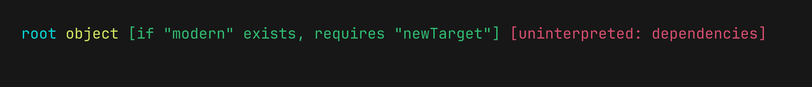
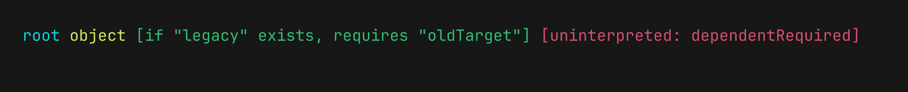
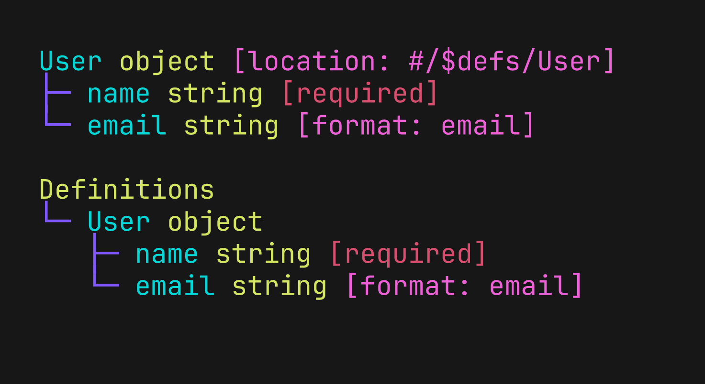
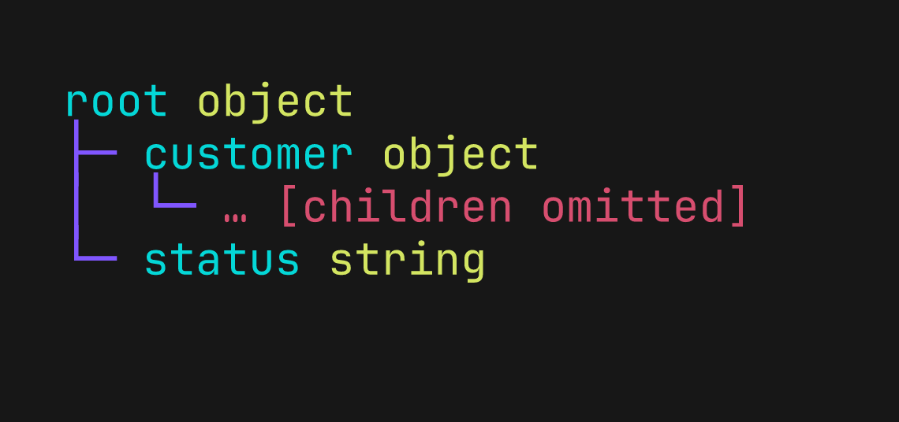
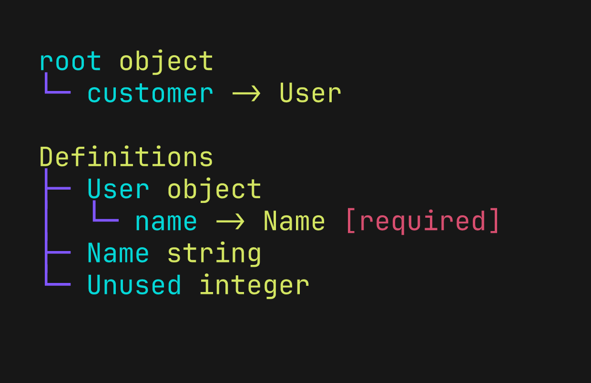
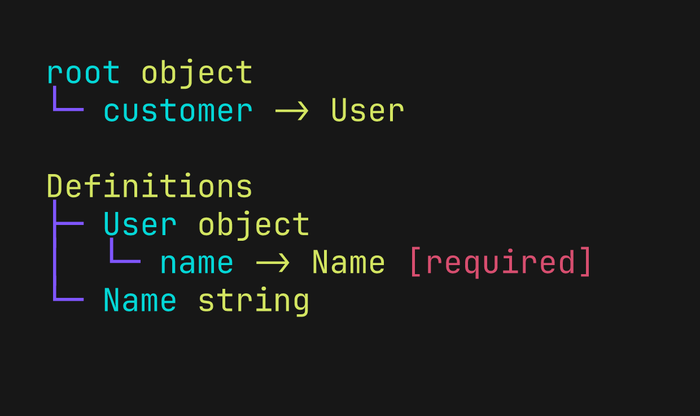
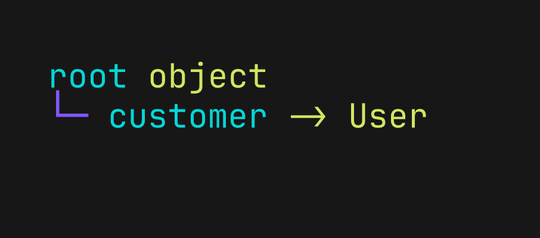
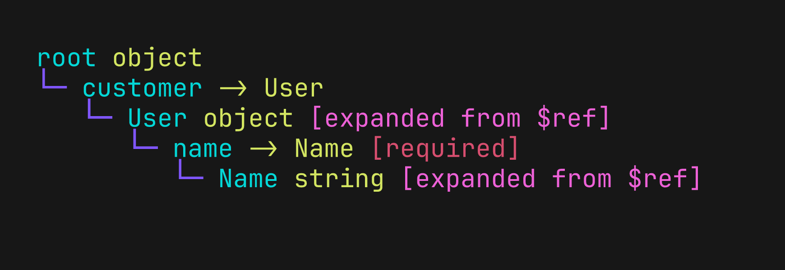

# CLI Options

This guide shows how each output-related Puu option changes the rendered tree. The images are generated from the real CLI with [Freeze](https://github.com/charmbracelet/freeze).

Run the following command from the repository root to update the images:

```sh
./scripts/generate-option-images.sh
```

## Contents

- [Draft override](#draft-override)
- [JSON Pointer selection](#json-pointer-selection)
- [Maximum display depth](#maximum-display-depth)
- [Definition display](#definition-display)
- [Reference expansion](#reference-expansion)

## Draft override

`-d DRAFT` / `--draft DRAFT` interprets the entire input as the selected JSON Schema draft, overriding its `$schema` declaration when present. The supported values are `2020-12`, `2019-09`, and `7`. Without this option, Puu uses the declared draft or assumes Draft 2020-12 when `$schema` is absent.

The example contains dependency keywords from both the modern drafts and Draft 7:

```json
{
  "type": "object",
  "dependencies": {
    "legacy": ["oldTarget"]
  },
  "dependentRequired": {
    "modern": ["newTarget"]
  }
}
```

[Example input](examples/options/draft.json)

With Draft 2019-09, the modern dependency keywords are interpreted and `dependencies` is left uninterpreted:

```console
puu --draft 2019-09 docs/examples/options/draft.json
```



With Draft 7, `dependencies` is interpreted and the newer keywords are left uninterpreted:

```console
puu --draft 7 docs/examples/options/draft.json
```



The override applies to embedded resources as well as the document root. It can therefore make an input invalid when a keyword has a different shape in the selected draft.

## JSON Pointer selection

`-p POINTER` / `--pointer POINTER` renders a schema at a particular location instead of starting at the document root. It accepts `#`, URI fragment JSON Pointers such as `#/$defs/User`, and JSON Pointers without the fragment marker such as `/$defs/User`.

```json
{
  "type": "object",
  "properties": {
    "orderId": { "type": "string" }
  },
  "$defs": {
    "User": {
      "type": "object",
      "required": ["name"],
      "properties": {
        "name": { "type": "string" },
        "email": { "type": "string", "format": "email" }
      }
    }
  }
}
```

[Example input](examples/options/pointer.json)

```console
puu --pointer '#/$defs/User' docs/examples/options/pointer.json
```



The selected node is labeled with its document location. Definitions are still displayed according to `--definitions`; the default `all` mode explains why `User` also appears in the separate `Definitions` section above. With `--definitions referenced`, reference traversal starts at the selected schema.

Quote pointers beginning with `#` so that the shell does not treat the value as a comment. A pointer must identify a schema rather than an arbitrary JSON value such as a `$ref` string.

## Maximum display depth

`-L N` / `--max-depth N` limits the indentation depth of every rendered tree, counting each root as depth 0. It keeps nodes at the limit and replaces their children with an explicit omission marker.

```json
{
  "type": "object",
  "properties": {
    "customer": {
      "type": "object",
      "properties": {
        "name": { "type": "string" },
        "address": {
          "type": "object",
          "properties": {
            "city": { "type": "string" }
          }
        }
      }
    },
    "status": { "type": "string" }
  }
}
```

[Example input](examples/options/max-depth.json)

```console
puu --max-depth 1 docs/examples/options/max-depth.json
```



A leaf at the limit is unchanged because it has no children to omit. Expanded reference targets and nodes in the separate `Definitions` section follow the same depth rule.

## Definition display

`-D MODE` / `--definitions MODE` controls the separate `Definitions` section. The default mode is `all`; the other modes are `referenced` and `none`.

The example references `User`, which in turn references `Name`, while `Unused` is not referenced:

```json
{
  "type": "object",
  "properties": {
    "customer": { "$ref": "#/$defs/User" }
  },
  "$defs": {
    "User": {
      "type": "object",
      "required": ["name"],
      "properties": {
        "name": { "$ref": "#/$defs/Name" }
      }
    },
    "Name": { "type": "string" },
    "Unused": { "type": "integer" }
  }
}
```

[Example input](examples/options/references.json)

### All definitions

`all` displays every definition and is the default:

```console
puu --definitions all docs/examples/options/references.json
```



### Referenced definitions

`referenced` displays definitions transitively reachable from the rendered schema. `Unused` is omitted, but `Name` remains because `User` references it:

```console
puu --definitions referenced docs/examples/options/references.json
```



### No definitions

`none` removes the separate section without hiding references in the rendered schema:

```console
puu --definitions none docs/examples/options/references.json
```



With `--pointer`, traversal in `referenced` mode starts at the selected schema. Definition selection follows references independently of `--max-depth`.

## Reference expansion

`-r` / `--expand-refs` adds the locally resolved target below each reference line. The reference remains visible with its own constraints and annotations, while the target is marked with `[expanded from $ref]`.

This example uses the same [reference input](examples/options/references.json) as the definition modes above. Without expansion, and with the separate definitions section hidden, only the reference is displayed:

```console
puu --definitions none docs/examples/options/references.json
```


Adding `--expand-refs` follows the reference chain from `User` to `Name`:

```console
puu --expand-refs --definitions none docs/examples/options/references.json
```



References are expanded transitively and repeated targets are expanded independently in each branch. Targets may be definitions, properties, logical branches, or other schemas in the input document. A reference back to a schema already on the current path is left visible with `[expansion stopped: cycle]`.

`--pointer` selects the starting schema but does not prevent references from reaching other parts of the document. `--definitions` independently controls the separate section; expansion also applies inside that section when it is displayed. Expanded targets count toward `--max-depth`.

Expansion is bounded to a display depth of 64 and 10,000 constructed expansion nodes across the output, excluding omission markers. Puu marks those boundaries with `[expansion stopped: depth limit]` or `[expansion stopped: node limit]`. External and unresolved references remain visible but are not fetched or expanded.

For locally resolved `$dynamicRef` and `$recursiveRef`, Puu expands the initial target recorded while loading the schema. When dynamic resolution could select a different target, the output includes `[initial target; dynamic scope not evaluated]`.
