# Successful Fixture Output Catalog

<!-- This file is generated by scripts/generate-render-fixtures.sh. Do not edit it directly. -->

This catalog lists the input and CLI output for each successful fixture in `tests/fixtures/render`. The images are generated from colorized standard output with [Freeze](https://github.com/charmbracelet/freeze).

Cargo and Go are required to update the catalog. Run the following command from the repository root:

```sh
./scripts/generate-render-fixtures.sh
```

## Featured Example

The [`order-model`](#order-model) fixture is a representative, practical schema. It demonstrates the CLI's typical output without attempting to cover every supported keyword.

## Contents

- [additional-schema](#additional-schema)
- [additional-true](#additional-true)
- [anchor-references](#anchor-references)
- [annotations](#annotations)
- [array-contains](#array-contains)
- [array-items](#array-items)
- [boolean-false](#boolean-false)
- [boolean-true](#boolean-true)
- [closed-object](#closed-object)
- [closed-with-allof](#closed-with-allof)
- [complex-item](#complex-item)
- [condition-without-if](#condition-without-if)
- [conditional-schema-dependencies](#conditional-schema-dependencies)
- [const-null](#const-null)
- [const-object](#const-object)
- [contains-boundaries](#contains-boundaries)
- [definitions](#definitions)
- [dependency-draft-selection](#dependency-draft-selection)
- [draft-2019-anchor](#draft-2019-anchor)
- [draft-2019-contains](#draft-2019-contains)
- [draft-2019-definition-alias](#draft-2019-definition-alias)
- [draft-2019-dependent-required](#draft-2019-dependent-required)
- [draft-2019-dependent-schemas](#draft-2019-dependent-schemas)
- [draft-2019-recursive-references](#draft-2019-recursive-references)
- [draft-2019-ref-sibling](#draft-2019-ref-sibling)
- [draft-2019-simple](#draft-2019-simple)
- [draft-2019-tuple](#draft-2019-tuple)
- [draft-2019-unevaluated-items](#draft-2019-unevaluated-items)
- [draft-7-additional-ignored](#draft-7-additional-ignored)
- [draft-7-annotations](#draft-7-annotations)
- [draft-7-contains](#draft-7-contains)
- [draft-7-definitions](#draft-7-definitions)
- [draft-7-dependencies](#draft-7-dependencies)
- [draft-7-dynamic-keywords](#draft-7-dynamic-keywords)
- [draft-7-id-anchor](#draft-7-id-anchor)
- [draft-7-ref-sibling](#draft-7-ref-sibling)
- [draft-7-simple](#draft-7-simple)
- [draft-7-tuple](#draft-7-tuple)
- [draft-7-unevaluated](#draft-7-unevaluated)
- [dynamic-references](#dynamic-references)
- [enum-const](#enum-const)
- [escaped-property-name](#escaped-property-name)
- [explicit-dialect](#explicit-dialect)
- [exponent-length](#exponent-length)
- [fractional-length](#fractional-length)
- [items-true](#items-true)
- [logical-composition](#logical-composition)
- [long-pattern](#long-pattern)
- [max-properties](#max-properties)
- [mixed-dialects](#mixed-dialects)
- [multiple-types](#multiple-types)
- [nested-definitions](#nested-definitions)
- [nested-object](#nested-object)
- [nested-string-length](#nested-string-length)
- [nullable-string](#nullable-string)
- [numeric-constraints](#numeric-constraints)
- [object-name-rules](#object-name-rules)
- [object-properties](#object-properties)
- [order-model](#order-model)
- [overlapping-bounds](#overlapping-bounds)
- [precise-number](#precise-number)
- [property-order](#property-order)
- [reference-pointer](#reference-pointer)
- [reference-root](#reference-root)
- [reference-type-sibling](#reference-type-sibling)
- [references](#references)
- [resource-references](#resource-references)
- [scalar-string](#scalar-string)
- [string-constraints](#string-constraints)
- [tuple-boolean](#tuple-boolean)
- [tuple-object](#tuple-object)
- [tuple-tail](#tuple-tail)
- [tuple](#tuple)
- [type-unspecified](#type-unspecified)
- [unevaluated-items](#unevaluated-items)
- [unevaluated-object](#unevaluated-object)
- [uninterpreted-keyword](#uninterpreted-keyword)
- [unmatched-required](#unmatched-required)
- [untyped-additional-false](#untyped-additional-false)
- [untyped-properties](#untyped-properties)
- [untyped-tuple](#untyped-tuple)

## additional-schema

[Source](../tests/fixtures/render/additional-schema.json)

### Input

```json
{
  "type": "object",
  "properties": {
    "known": {
      "type": "string"
    }
  },
  "additionalProperties": {
    "type": "integer",
    "minimum": 0
  }
}
```

### Output

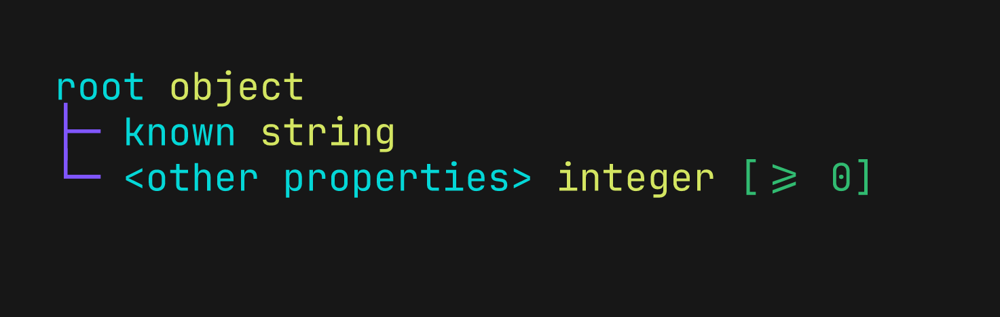

## additional-true

[Source](../tests/fixtures/render/additional-true.json)

### Input

```json
{
  "type": "object",
  "additionalProperties": true
}
```

### Output

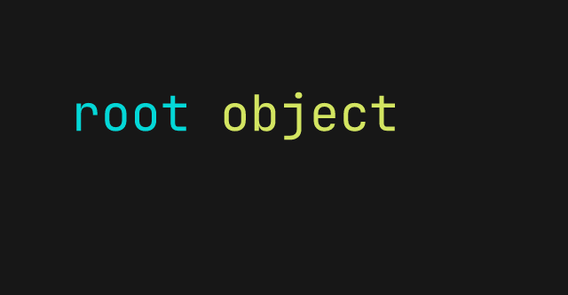

## anchor-references

[Source](../tests/fixtures/render/anchor-references.json)

### Input

```json
{
  "$schema": "https://json-schema.org/draft/2020-12/schema",
  "$id": "https://example.test/root.json",
  "type": "object",
  "properties": {
    "rootValue": {
      "$ref": "#value"
    },
    "childValue": {
      "$ref": "child.json#value"
    }
  },
  "$defs": {
    "rootValue": {
      "$anchor": "value",
      "type": "string"
    },
    "child": {
      "$id": "child.json",
      "type": "object",
      "properties": {
        "value": {
          "$anchor": "value",
          "type": "integer"
        },
        "rootValue": {
          "$ref": "root.json#value"
        }
      }
    }
  }
}
```

### Output

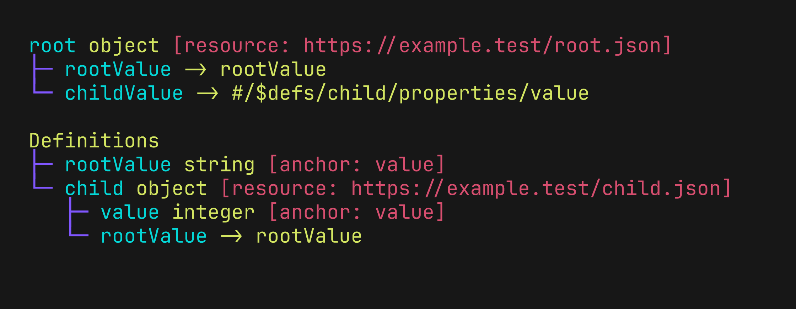

## annotations

[Source](../tests/fixtures/render/annotations.json)

### Input

```json
{
  "$schema": "https://json-schema.org/draft/2020-12/schema",
  "$vocabulary": {
    "https://json-schema.org/draft/2020-12/vocab/core": true,
    "https://example.test/vocab/order": false
  },
  "$comment": "Used by schema maintainers only.\nKeep this out of the compact view.",
  "title": "Order",
  "description": "Purchase orders shared across teams and systems.\nThis sentence makes the summary longer than the normal display limit.",
  "type": "object",
  "default": {
    "status": "draft",
    "items": []
  },
  "examples": [
    {
      "id": "A-100"
    },
    {
      "id": "B-200"
    }
  ],
  "deprecated": true,
  "properties": {
    "id": {
      "type": "string",
      "readOnly": true
    },
    "payload": {
      "type": "string",
      "writeOnly": true,
      "contentEncoding": "base64",
      "contentMediaType": "application/json",
      "contentSchema": {
        "type": "object",
        "properties": {
          "status": {
            "type": "string"
          }
        }
      }
    },
    "detached": {
      "type": "string",
      "contentSchema": {
        "type": "integer"
      }
    }
  }
}
```

### Output

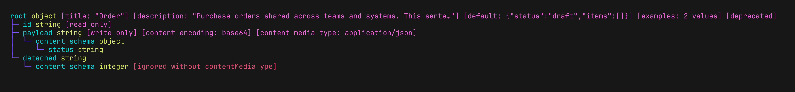

## array-contains

[Source](../tests/fixtures/render/array-contains.json)

### Input

```json
{
  "$schema": "https://json-schema.org/draft/2020-12/schema",
  "$defs": {
    "HighValue": {
      "type": "number",
      "minimum": 100
    }
  },
  "type": "array",
  "items": {
    "type": "number"
  },
  "contains": {
    "$ref": "#/$defs/HighValue"
  },
  "minContains": 2,
  "maxContains": 4
}
```

### Output

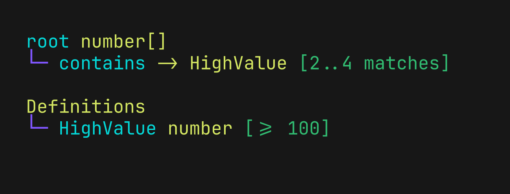

## array-items

[Source](../tests/fixtures/render/array-items.json)

### Input

```json
{
  "type": "object",
  "properties": {
    "tags": {
      "type": "array",
      "items": {
        "type": "string"
      },
      "minItems": 1,
      "maxItems": 10,
      "uniqueItems": true
    },
    "records": {
      "type": "array",
      "items": {
        "type": "object",
        "properties": {
          "key": {
            "type": "string"
          }
        }
      }
    },
    "restricted": {
      "type": "array",
      "items": false
    },
    "untyped": {
      "items": {
        "type": "string"
      }
    }
  }
}
```

### Output

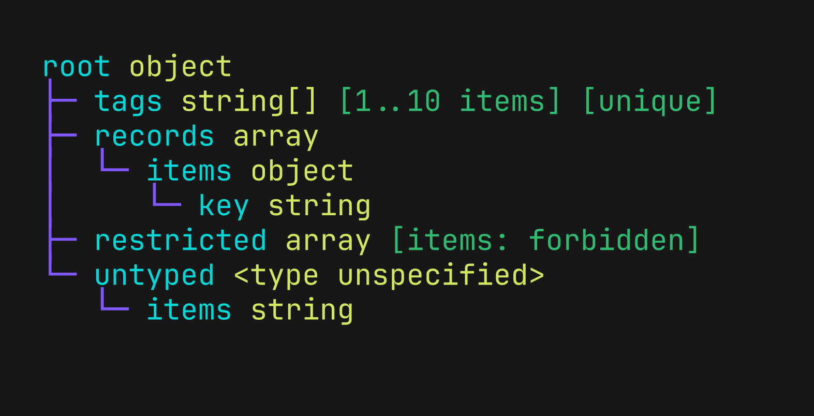

## boolean-false

[Source](../tests/fixtures/render/boolean-false.json)

### Input

```json
false
```

### Output


## boolean-true

[Source](../tests/fixtures/render/boolean-true.json)

### Input

```json
true
```

### Output


## closed-object

[Source](../tests/fixtures/render/closed-object.json)

### Input

```json
{
  "type": "object",
  "properties": {
    "name": {
      "type": "string"
    }
  },
  "minProperties": 1,
  "maxProperties": 3,
  "additionalProperties": false
}
```

### Output

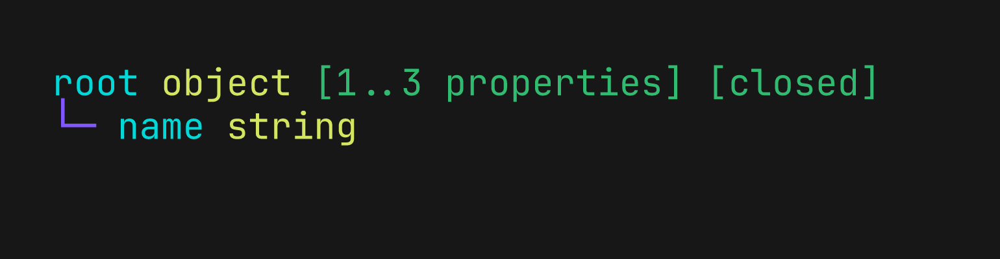

## closed-with-allof

[Source](../tests/fixtures/render/closed-with-allof.json)

### Input

```json
{
  "type": "object",
  "allOf": [
    {
      "properties": {
        "x": {
          "type": "string"
        }
      }
    }
  ],
  "additionalProperties": false
}
```

### Output

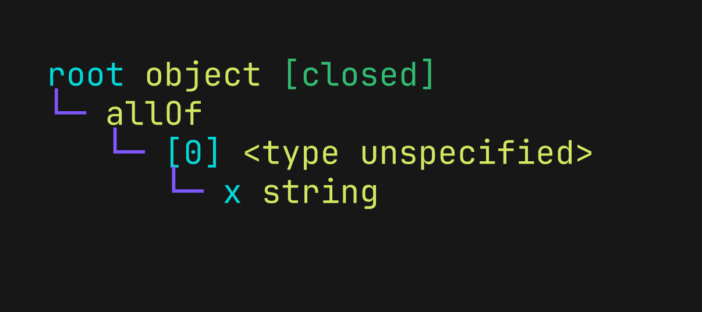

## complex-item

[Source](../tests/fixtures/render/complex-item.json)

### Input

```json
{
  "type": "array",
  "items": {
    "type": "string",
    "minLength": 1
  }
}
```

### Output

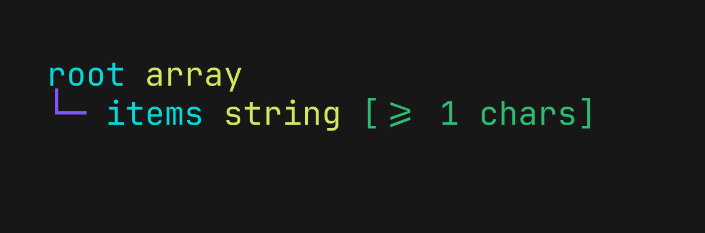

## condition-without-if

[Source](../tests/fixtures/render/condition-without-if.json)

### Input

```json
{
  "type": "object",
  "then": {
    "properties": {
      "enabled": {
        "const": true
      }
    }
  },
  "else": false
}
```

### Output

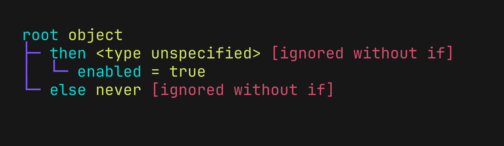

## conditional-schema-dependencies

[Source](../tests/fixtures/render/conditional-schema-dependencies.json)

### Input

```json
{
  "$schema": "https://json-schema.org/draft/2020-12/schema",
  "$defs": {
    "Address": {
      "type": "object",
      "properties": {
        "postalCode": {
          "type": "string"
        }
      },
      "required": ["postalCode"]
    }
  },
  "type": "object",
  "properties": {
    "kind": {
      "type": "string"
    },
    "billingAddress": {
      "type": "object"
    }
  },
  "dependentSchemas": {
    "billingAddress": {
      "properties": {
        "billingCountry": {
          "type": "string"
        }
      },
      "required": ["billingCountry"]
    },
    "recursive": {
      "$ref": "#"
    }
  },
  "if": {
    "properties": {
      "kind": {
        "const": "digital"
      }
    },
    "required": ["kind"]
  },
  "then": {
    "properties": {
      "downloadUrl": {
        "type": "string",
        "format": "uri"
      }
    },
    "required": ["downloadUrl"]
  },
  "else": {
    "properties": {
      "shippingAddress": {
        "$ref": "#/$defs/Address"
      }
    },
    "required": ["shippingAddress"]
  }
}
```

### Output

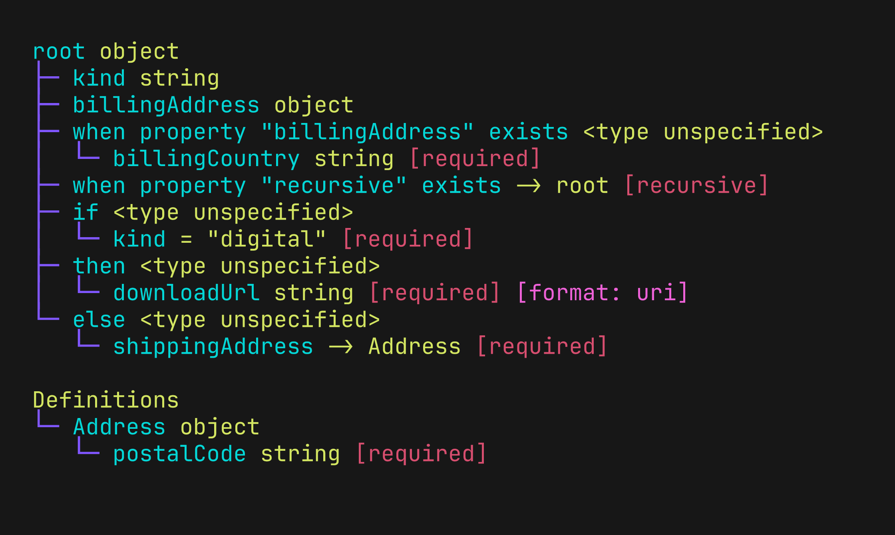

## const-null

[Source](../tests/fixtures/render/const-null.json)

### Input

```json
{
  "const": null
}
```

### Output

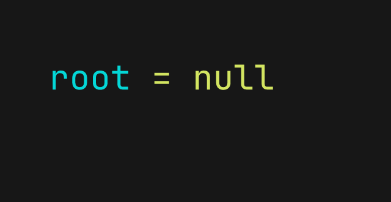

## const-object

[Source](../tests/fixtures/render/const-object.json)

### Input

```json
{
  "const": {
    "x": 1
  }
}
```

### Output

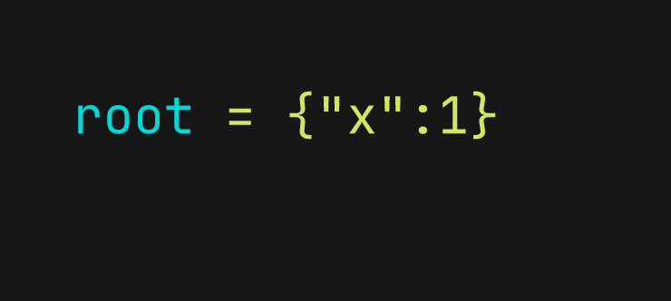

## contains-boundaries

[Source](../tests/fixtures/render/contains-boundaries.json)

### Input

```json
{
  "type": "object",
  "properties": {
    "defaultCount": {
      "type": "array",
      "contains": {
        "type": "string"
      }
    },
    "optionalMatch": {
      "type": "array",
      "contains": {
        "type": "string",
        "pattern": "^x-"
      },
      "minContains": 0
    },
    "capped": {
      "type": "array",
      "contains": {
        "type": "integer"
      },
      "maxContains": 3
    },
    "withoutContains": {
      "type": "array",
      "minContains": 0,
      "maxContains": 2
    }
  }
}
```

### Output

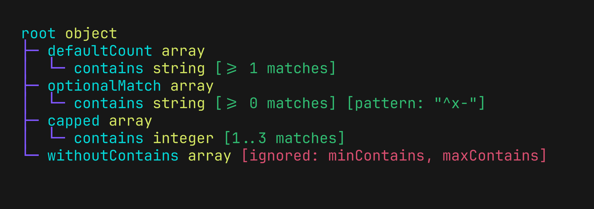

## definitions

[Source](../tests/fixtures/render/definitions.json)

### Input

```json
{
  "type": "object",
  "properties": {
    "orderId": { "type": "string" }
  },
  "$defs": {
    "Address": {
      "type": "object",
      "properties": {
        "city": { "type": "string" }
      },
      "required": ["city"],
      "additionalProperties": false
    },
    "Status": {
      "type": "string",
      "enum": ["pending", "paid"]
    }
  }
}
```

### Output

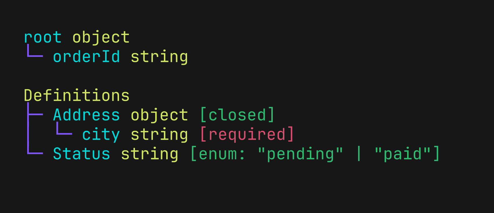

## dependency-draft-selection

[Source](../tests/fixtures/render/dependency-draft-selection.json)

### Input

```json
{
  "type": "object",
  "dependencies": {
    "legacyTrigger": ["legacyTarget"],
    "legacySchema": {
      "required": ["legacyField"]
    }
  },
  "dependentRequired": {
    "modernTrigger": ["modernTarget"]
  },
  "dependentSchemas": {
    "modernSchema": {
      "required": ["modernField"]
    }
  }
}
```

### Output

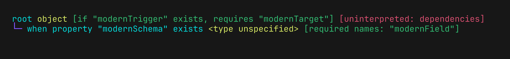

## draft-2019-anchor

[Source](../tests/fixtures/render/draft-2019-anchor.json)

### Input

```json
{
  "$schema": "https://json-schema.org/draft/2019-09/schema",
  "$anchor": "root:name",
  "type": "object",
  "properties": {
    "self": {
      "$ref": "#root:name"
    }
  }
}
```

### Output

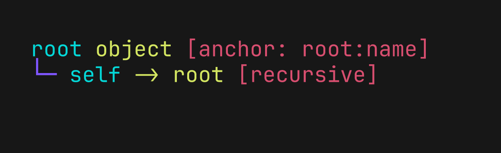

## draft-2019-contains

[Source](../tests/fixtures/render/draft-2019-contains.json)

### Input

```json
{
  "$schema": "https://json-schema.org/draft/2019-09/schema",
  "type": "array",
  "contains": {
    "type": "object",
    "required": ["id"]
  },
  "minContains": 2
}
```

### Output

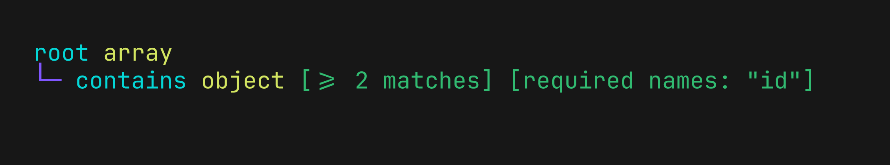

## draft-2019-definition-alias

[Source](../tests/fixtures/render/draft-2019-definition-alias.json)

### Input

```json
{
  "$schema": "https://json-schema.org/draft/2019-09/schema",
  "type": "object",
  "properties": {
    "old": { "$ref": "#/definitions/Status" },
    "new": { "$ref": "#/$defs/Status" }
  },
  "definitions": {
    "Status": { "type": "integer" }
  },
  "$defs": {
    "Status": { "type": "string" }
  }
}
```

### Output

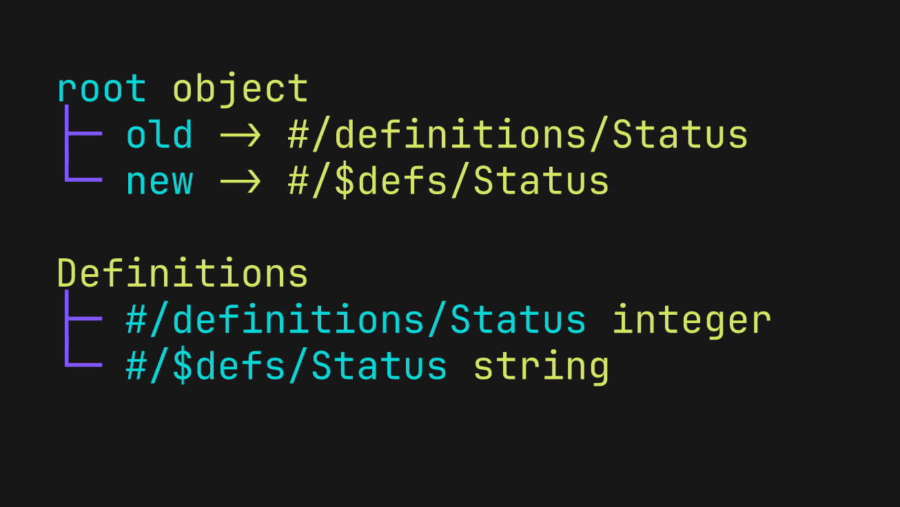

## draft-2019-dependent-required

[Source](../tests/fixtures/render/draft-2019-dependent-required.json)

### Input

```json
{
  "$schema": "https://json-schema.org/draft/2019-09/schema",
  "type": "object",
  "properties": {
    "token": {
      "type": "string"
    },
    "expiresAt": {
      "type": "string",
      "format": "date-time"
    }
  },
  "dependentRequired": {
    "token": ["expiresAt"]
  }
}
```

### Output

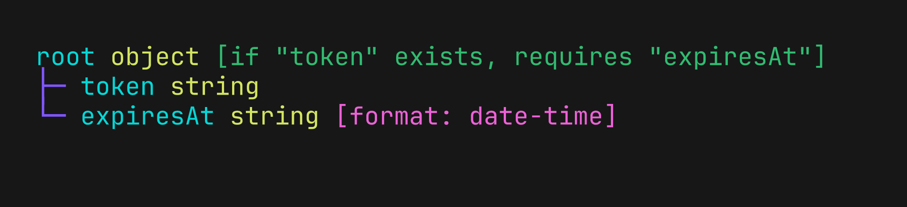

## draft-2019-dependent-schemas

[Source](../tests/fixtures/render/draft-2019-dependent-schemas.json)

### Input

```json
{
  "$schema": "https://json-schema.org/draft/2019-09/schema",
  "type": "object",
  "dependentSchemas": {
    "creditCard": {
      "required": ["billingAddress"]
    }
  }
}
```

### Output

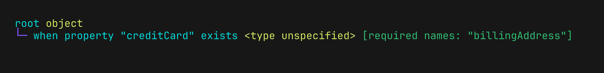

## draft-2019-recursive-references

[Source](../tests/fixtures/render/draft-2019-recursive-references.json)

### Input

```json
{
  "$schema": "https://json-schema.org/draft/2019-09/schema",
  "$id": "https://example.test/tree.json",
  "$recursiveAnchor": true,
  "type": "object",
  "properties": {
    "children": {
      "type": "array",
      "items": {
        "$recursiveRef": "#"
      }
    }
  },
  "$defs": {
    "plain": {
      "$id": "plain.json",
      "type": "object",
      "properties": {
        "self": {
          "$recursiveRef": "#"
        }
      }
    }
  }
}
```

### Output

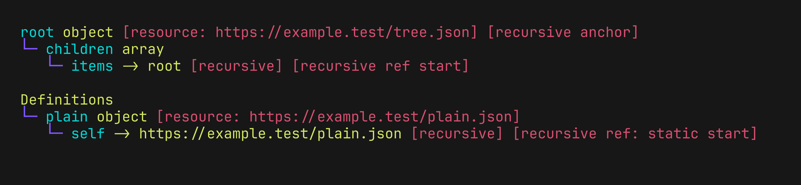

## draft-2019-ref-sibling

[Source](../tests/fixtures/render/draft-2019-ref-sibling.json)

### Input

```json
{
  "$schema": "https://json-schema.org/draft/2019-09/schema",
  "$ref": "#/$defs/Base",
  "maxProperties": 1,
  "type": "object",
  "properties": {
    "extra": { "type": "string" }
  },
  "$defs": {
    "Base": {
      "type": "object",
      "properties": {
        "id": { "type": "integer" }
      }
    }
  }
}
```

### Output

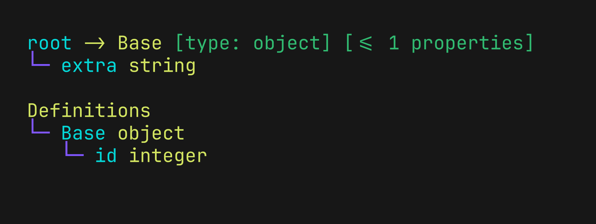

## draft-2019-simple

[Source](../tests/fixtures/render/draft-2019-simple.json)

### Input

```json
{
  "$schema": "https://json-schema.org/draft/2019-09/schema",
  "type": "string"
}
```

### Output


## draft-2019-tuple

[Source](../tests/fixtures/render/draft-2019-tuple.json)

### Input

```json
{
  "$schema": "https://json-schema.org/draft/2019-09/schema",
  "type": "array",
  "items": [
    { "type": "string" },
    { "$ref": "#/$defs/Amount" },
    { "$ref": "#/items/0" }
  ],
  "additionalItems": false,
  "$defs": {
    "Amount": { "type": "integer", "minimum": 0 }
  }
}
```

### Output

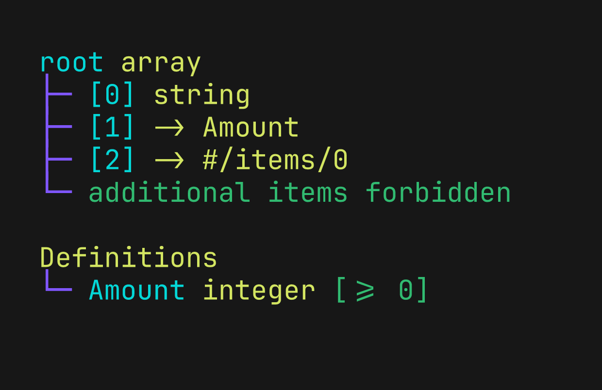

## draft-2019-unevaluated-items

[Source](../tests/fixtures/render/draft-2019-unevaluated-items.json)

### Input

```json
{
  "$schema": "https://json-schema.org/draft/2019-09/schema",
  "type": "array",
  "items": [
    {
      "type": "string"
    }
  ],
  "contains": {
    "type": "integer"
  },
  "unevaluatedItems": false
}
```

### Output

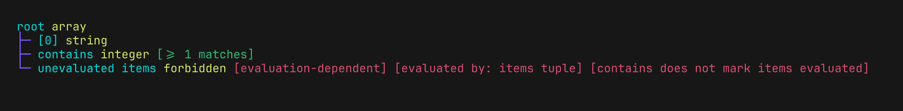

## draft-7-additional-ignored

[Source](../tests/fixtures/render/draft-7-additional-ignored.json)

### Input

```json
{
  "$schema": "http://json-schema.org/draft-07/schema#",
  "type": "array",
  "items": { "type": "string" },
  "additionalItems": false,
  "prefixItems": [ { "type": "integer" } ]
}
```

### Output

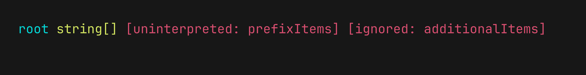

## draft-7-annotations

[Source](../tests/fixtures/render/draft-7-annotations.json)

### Input

```json
{
  "$schema": "http://json-schema.org/draft-07/schema#",
  "$vocabulary": {
    "https://example.test/vocab": true
  },
  "type": "string",
  "title": "Legacy payload",
  "$comment": "Visible in verbose mode",
  "deprecated": true,
  "readOnly": true,
  "contentMediaType": "application/json",
  "contentSchema": {
    "type": "object"
  }
}
```

### Output

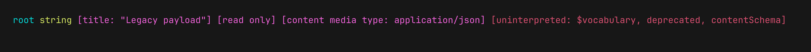

## draft-7-contains

[Source](../tests/fixtures/render/draft-7-contains.json)

### Input

```json
{
  "$schema": "http://json-schema.org/draft-07/schema#",
  "type": "array",
  "contains": {
    "type": "integer"
  },
  "minContains": 2,
  "maxContains": 4
}
```

### Output

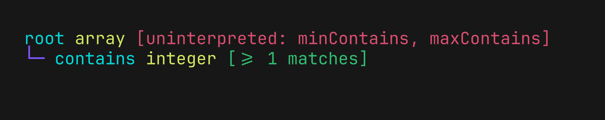

## draft-7-definitions

[Source](../tests/fixtures/render/draft-7-definitions.json)

### Input

```json
{
  "$schema": "http://json-schema.org/draft-07/schema#",
  "type": "object",
  "properties": {
    "home": { "$ref": "#/definitions/Address" },
    "office": { "$ref": "#/definitions/Address" }
  },
  "definitions": {
    "Address": {
      "type": "object",
      "properties": {
        "city": { "type": "string" }
      },
      "required": ["city"]
    }
  }
}
```

### Output

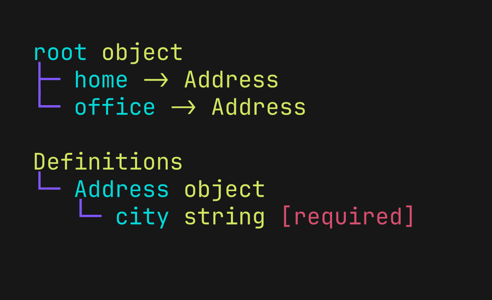

## draft-7-dependencies

[Source](../tests/fixtures/render/draft-7-dependencies.json)

### Input

```json
{
  "$schema": "http://json-schema.org/draft-07/schema#",
  "type": "object",
  "properties": {
    "token": {
      "type": "string"
    },
    "expiresAt": {
      "type": "string",
      "format": "date-time"
    }
  },
  "dependencies": {
    "token": ["expiresAt"],
    "legacy": [],
    "country": {
      "properties": {
        "postalCode": {
          "type": "string"
        }
      }
    }
  }
}
```

### Output

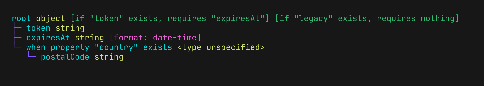

## draft-7-dynamic-keywords

[Source](../tests/fixtures/render/draft-7-dynamic-keywords.json)

### Input

```json
{
  "$schema": "http://json-schema.org/draft-07/schema#",
  "type": "object",
  "$recursiveAnchor": true,
  "$recursiveRef": "#",
  "$dynamicAnchor": "node",
  "$dynamicRef": "#node"
}
```

### Output

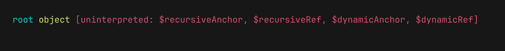

## draft-7-id-anchor

[Source](../tests/fixtures/render/draft-7-id-anchor.json)

### Input

```json
{
  "$schema": "http://json-schema.org/draft-07/schema#",
  "$anchor": "unsupported",
  "type": "object",
  "properties": {
    "named": {
      "$ref": "#named:value"
    }
  },
  "definitions": {
    "named": {
      "$id": "#named:value",
      "type": "string"
    }
  }
}
```

### Output

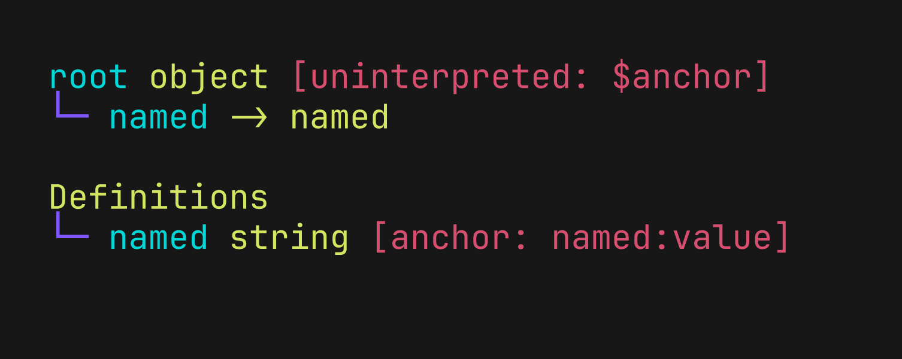

## draft-7-ref-sibling

[Source](../tests/fixtures/render/draft-7-ref-sibling.json)

### Input

```json
{
  "$schema": "http://json-schema.org/draft-07/schema#",
  "$ref": "#/definitions/Base",
  "maxProperties": 1,
  "type": "object",
  "properties": {
    "extra": { "type": "string" }
  },
  "definitions": {
    "Base": {
      "type": "object",
      "properties": {
        "id": { "type": "integer" }
      }
    }
  }
}
```

### Output

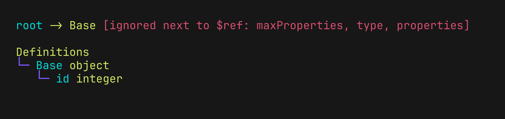

## draft-7-simple

[Source](../tests/fixtures/render/draft-7-simple.json)

### Input

```json
{
  "$schema": "http://json-schema.org/draft-07/schema#",
  "type": "string"
}
```

### Output


## draft-7-tuple

[Source](../tests/fixtures/render/draft-7-tuple.json)

### Input

```json
{
  "$schema": "http://json-schema.org/draft-07/schema#",
  "type": "array",
  "items": [
    { "type": "string" },
    { "type": "integer" }
  ],
  "additionalItems": { "type": "string" }
}
```

### Output

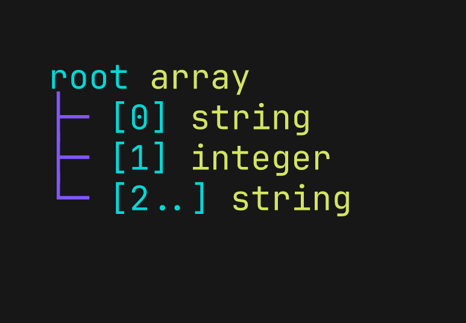

## draft-7-unevaluated

[Source](../tests/fixtures/render/draft-7-unevaluated.json)

### Input

```json
{
  "$schema": "http://json-schema.org/draft-07/schema#",
  "type": "object",
  "unevaluatedProperties": false,
  "unevaluatedItems": false
}
```

### Output

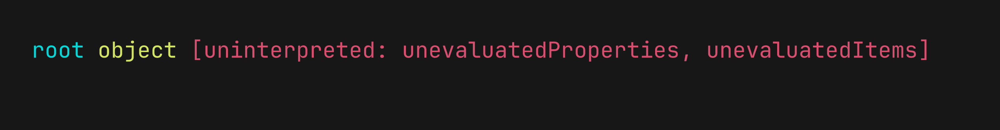

## dynamic-references

[Source](../tests/fixtures/render/dynamic-references.json)

### Input

```json
{
  "$schema": "https://json-schema.org/draft/2020-12/schema",
  "$id": "https://example.test/tree.json",
  "$dynamicAnchor": "node",
  "type": "object",
  "properties": {
    "children": {
      "type": "array",
      "items": {
        "$dynamicRef": "#node"
      }
    },
    "plain": {
      "$dynamicRef": "#plain"
    },
    "combined": {
      "$ref": "#plain",
      "$dynamicRef": "#node",
      "type": "string"
    }
  },
  "$defs": {
    "plain": {
      "$anchor": "plain",
      "type": "string"
    }
  }
}
```

### Output

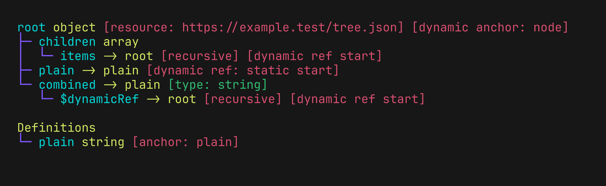

## enum-const

[Source](../tests/fixtures/render/enum-const.json)

### Input

```json
{
  "type": "object",
  "properties": {
    "role": {
      "type": "string",
      "enum": [
        "admin",
        "user"
      ]
    },
    "mixed": {
      "enum": [
        "red",
        null,
        42
      ]
    },
    "kind": {
      "const": "cat"
    },
    "version": {
      "type": "integer",
      "const": 2
    },
    "both": {
      "type": "string",
      "const": "a",
      "enum": [
        "a",
        "b"
      ]
    },
    "many": {
      "enum": [
        "a",
        "b",
        "c",
        "d",
        "e"
      ]
    }
  }
}
```

### Output

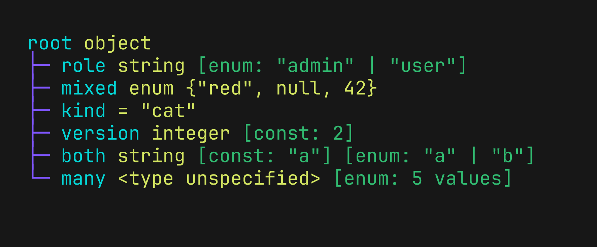

## escaped-property-name

[Source](../tests/fixtures/render/escaped-property-name.json)

### Input

```json
{
  "type": "object",
  "properties": {
    "line\nbreak": {
      "type": "string"
    }
  }
}
```

### Output

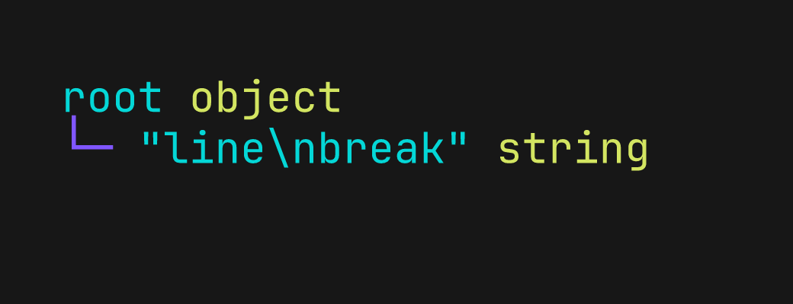

## explicit-dialect

[Source](../tests/fixtures/render/explicit-dialect.json)

### Input

```json
{
  "$schema": "https://json-schema.org/draft/2020-12/schema",
  "type": "string"
}
```

### Output


## exponent-length

[Source](../tests/fixtures/render/exponent-length.json)

### Input

```json
{
  "type": "string",
  "minLength": 10e-1
}
```

### Output

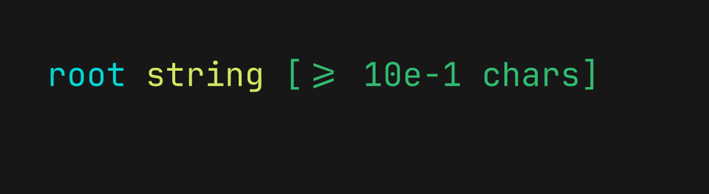

## fractional-length

[Source](../tests/fixtures/render/fractional-length.json)

### Input

```json
{
  "type": "string",
  "minLength": 1.0
}
```

### Output

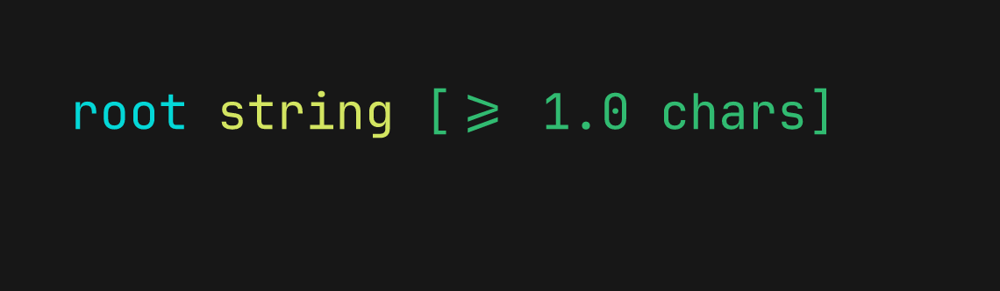

## items-true

[Source](../tests/fixtures/render/items-true.json)

### Input

```json
{
  "type": "array",
  "items": true,
  "uniqueItems": false
}
```

### Output

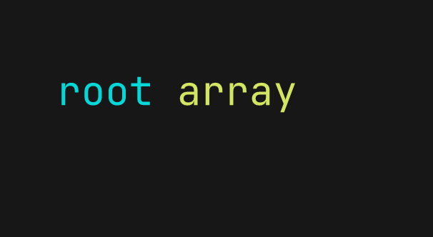

## logical-composition

[Source](../tests/fixtures/render/logical-composition.json)

### Input

```json
{
  "$schema": "https://json-schema.org/draft/2020-12/schema",
  "$defs": {
    "BaseRecord": {
      "type": "object",
      "properties": {
        "id": {
          "type": "string"
        }
      },
      "required": ["id"]
    }
  },
  "type": "object",
  "allOf": [
    {
      "$ref": "#/$defs/BaseRecord"
    },
    {
      "type": "object",
      "properties": {
        "active": {
          "type": "boolean"
        }
      },
      "additionalProperties": false
    }
  ],
  "anyOf": [
    {
      "required": ["email"]
    },
    {
      "required": ["phone"]
    }
  ],
  "oneOf": [
    {
      "$defs": {
        "PersonalKind": {
          "const": "personal"
        }
      },
      "properties": {
        "kind": {
          "$ref": "#/oneOf/0/$defs/PersonalKind"
        }
      }
    },
    {
      "properties": {
        "kind": {
          "const": "business"
        }
      }
    }
  ],
  "not": {
    "required": ["deletedAt"]
  }
}
```

### Output

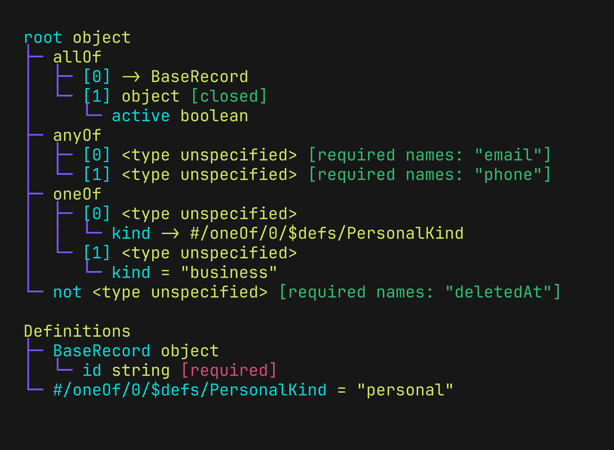

## long-pattern

[Source](../tests/fixtures/render/long-pattern.json)

### Input

```json
{
  "type": "string",
  "pattern": "^abcdefghijklmnopqrstuvwxyz0123456789ABCDEFGHIJKLMNOPQRSTUVWXYZ$"
}
```

### Output

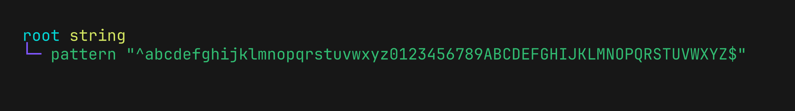

## max-properties

[Source](../tests/fixtures/render/max-properties.json)

### Input

```json
{
  "type": "object",
  "maxProperties": 10
}
```

### Output

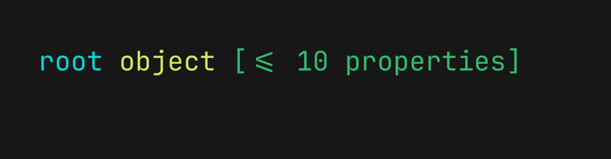

## mixed-dialects

[Source](../tests/fixtures/render/mixed-dialects.json)

### Input

```json
{
  "$schema": "https://json-schema.org/draft/2020-12/schema",
  "type": "object",
  "properties": {
    "legacy": {
      "$id": "https://example.test/legacy",
      "$schema": "http://json-schema.org/draft-07/schema#",
      "type": "array",
      "items": [ { "type": "string" } ],
      "additionalItems": false
    },
    "current": {
      "type": "array",
      "prefixItems": [ { "type": "integer" } ],
      "items": false
    },
    "inherited": {
      "$id": "https://example.test/inherited",
      "type": "array",
      "prefixItems": [ { "type": "boolean" } ],
      "items": false
    }
  }
}
```

### Output

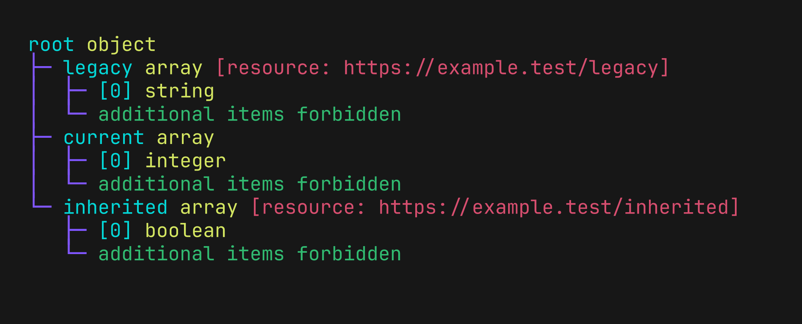

## multiple-types

[Source](../tests/fixtures/render/multiple-types.json)

### Input

```json
{
  "type": [
    "number",
    "boolean",
    "null"
  ]
}
```

### Output

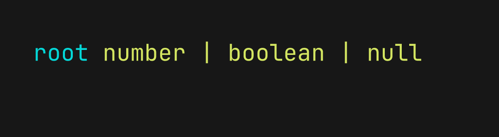

## nested-definitions

[Source](../tests/fixtures/render/nested-definitions.json)

### Input

```json
{
  "type": "object",
  "properties": {
    "shipping": {
      "type": "object",
      "properties": {
        "value": { "$ref": "#/properties/shipping/$defs/Value" }
      },
      "$defs": {
        "Value": { "type": "string", "minLength": 1 }
      }
    },
    "billing": {
      "type": "object",
      "properties": {
        "value": { "$ref": "#/properties/billing/$defs/Value" }
      },
      "$defs": {
        "Value": { "type": "integer", "minimum": 0 }
      }
    }
  }
}
```

### Output

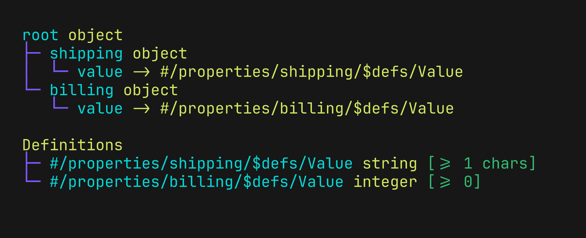

## nested-object

[Source](../tests/fixtures/render/nested-object.json)

### Input

```json
{
  "type": "object",
  "properties": {
    "user": {
      "type": "object",
      "properties": {
        "id": {
          "type": "string"
        },
        "active": true
      },
      "required": [
        "id"
      ]
    },
    "tags": {
      "type": "array"
    }
  }
}
```

### Output

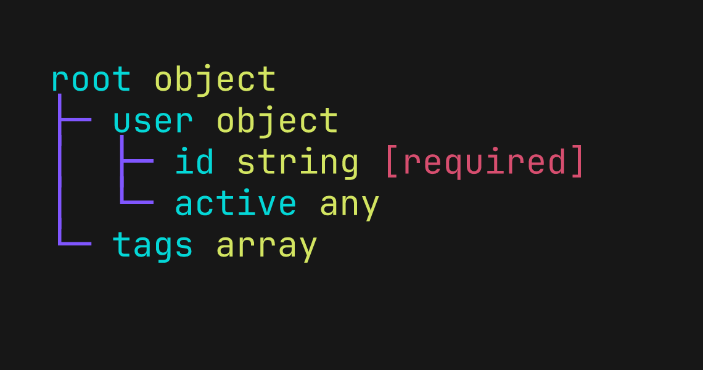

## nested-string-length

[Source](../tests/fixtures/render/nested-string-length.json)

### Input

```json
{
  "type": "object",
  "properties": {
    "name": {
      "type": "string",
      "minLength": 1
    }
  }
}
```

### Output

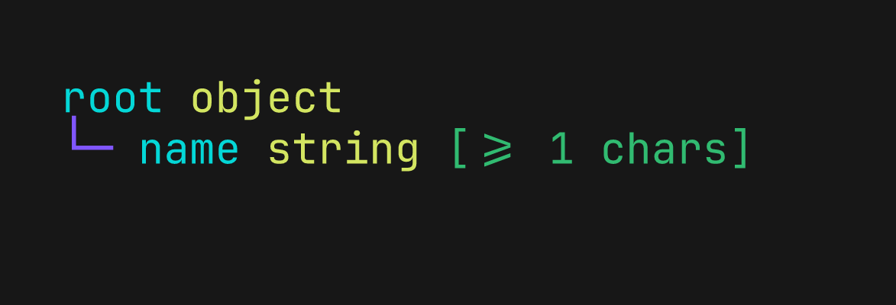

## nullable-string

[Source](../tests/fixtures/render/nullable-string.json)

### Input

```json
{
  "type": [
    "string",
    "null"
  ]
}
```

### Output

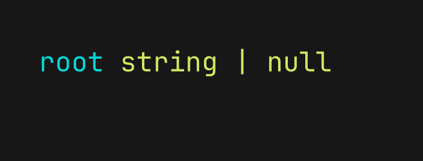

## numeric-constraints

[Source](../tests/fixtures/render/numeric-constraints.json)

### Input

```json
{
  "type": "object",
  "properties": {
    "age": {
      "type": "integer",
      "minimum": 0
    },
    "score": {
      "type": "number",
      "minimum": 0,
      "maximum": 1
    },
    "ratio": {
      "type": "number",
      "exclusiveMinimum": 0,
      "exclusiveMaximum": 1,
      "multipleOf": 0.01
    },
    "untyped": {
      "minimum": 0
    }
  }
}
```

### Output

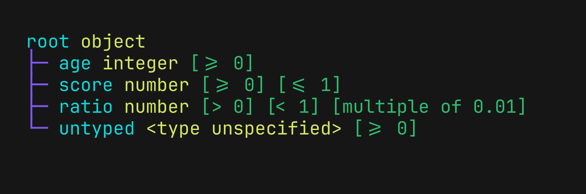

## object-name-rules

[Source](../tests/fixtures/render/object-name-rules.json)

### Input

```json
{
  "$schema": "https://json-schema.org/draft/2020-12/schema",
  "$defs": {
    "MetadataValue": {
      "type": ["string", "number", "boolean"]
    },
    "PropertyName": {
      "type": "string",
      "maxLength": 32,
      "pattern": "^[A-Za-z][A-Za-z0-9_-]*$"
    }
  },
  "type": "object",
  "properties": {
    "id": {
      "type": "string"
    },
    "creditCard": {
      "type": "string"
    },
    "billingAddress": {
      "type": "string"
    }
  },
  "required": ["id"],
  "patternProperties": {
    "^x-": {
      "$ref": "#/$defs/MetadataValue"
    },
    "^count-": {
      "type": "integer",
      "minimum": 0
    }
  },
  "propertyNames": {
    "$ref": "#/$defs/PropertyName"
  },
  "dependentRequired": {
    "creditCard": ["billingAddress"],
    "billingAddress": ["creditCard"],
    "legacy": []
  },
  "additionalProperties": false
}
```

### Output

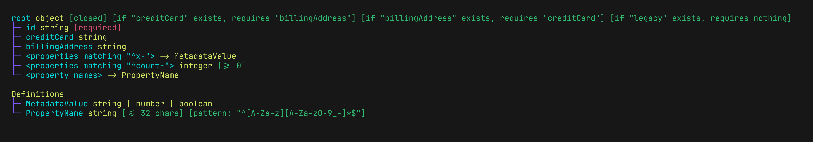

## object-properties

[Source](../tests/fixtures/render/object-properties.json)

### Input

```json
{
  "type": "object",
  "properties": {
    "name": {
      "type": "string"
    },
    "age": {
      "type": "integer"
    }
  },
  "required": [
    "name"
  ]
}
```

### Output

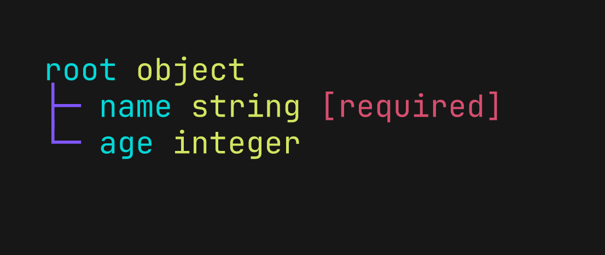

## order-model

[Source](../tests/fixtures/render/order-model.json)

### Input

```json
{
  "$schema": "https://json-schema.org/draft/2020-12/schema",
  "title": "Order",
  "description": "A customer order.",
  "type": "object",
  "properties": {
    "orderId": {
      "type": "string",
      "format": "uuid",
      "readOnly": true
    },
    "status": {
      "type": "string",
      "enum": ["pending", "paid", "shipped"]
    },
    "customer": {
      "type": "object",
      "properties": {
        "name": {
          "type": "string",
          "minLength": 1,
          "maxLength": 80
        },
        "email": {
          "type": "string",
          "format": "email"
        },
        "loyaltyTier": {
          "type": ["string", "null"],
          "enum": ["bronze", "silver", null]
        }
      },
      "required": ["name", "email"],
      "additionalProperties": false
    },
    "lineItems": {
      "type": "array",
      "items": {
        "type": "object",
        "properties": {
          "sku": {
            "type": "string",
            "pattern": "^[A-Z0-9-]+$"
          },
          "quantity": {
            "type": "integer",
            "minimum": 1
          },
          "unitPrice": {
            "type": "number",
            "minimum": 0,
            "multipleOf": 0.01
          }
        },
        "required": ["sku", "quantity", "unitPrice"],
        "additionalProperties": false
      },
      "minItems": 1
    },
    "labels": {
      "type": "array",
      "items": { "type": "string" },
      "uniqueItems": true
    },
    "deliveryWindow": {
      "type": "array",
      "minItems": 2,
      "prefixItems": [
        { "type": "string", "format": "date-time" },
        { "type": "string", "format": "date-time" }
      ],
      "items": false
    },
    "metadata": {
      "type": "object",
      "additionalProperties": { "type": "string" }
    },
    "giftNote": {
      "type": ["string", "null"],
      "maxLength": 200
    }
  },
  "required": ["orderId", "status", "customer", "lineItems"],
  "additionalProperties": false
}
```

### Output

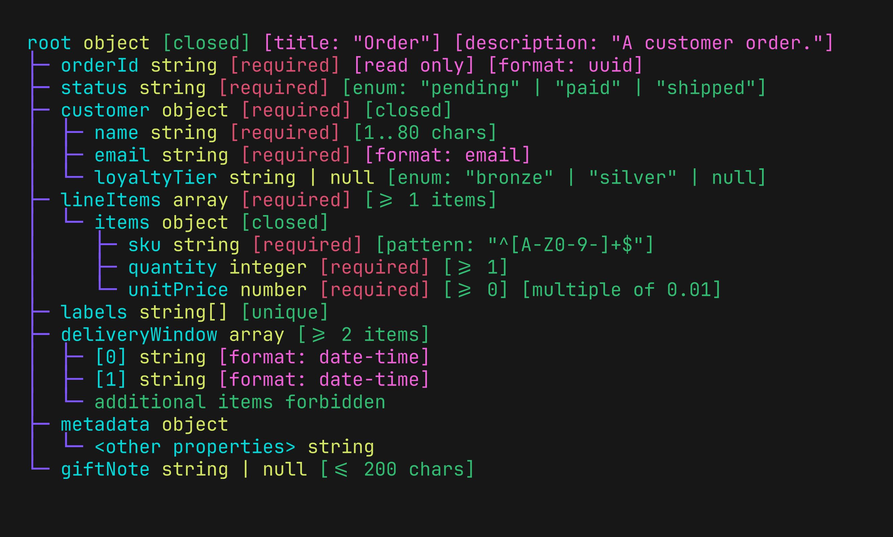

## overlapping-bounds

[Source](../tests/fixtures/render/overlapping-bounds.json)

### Input

```json
{
  "type": "number",
  "minimum": 0,
  "exclusiveMinimum": -1,
  "maximum": 10,
  "exclusiveMaximum": 11
}
```

### Output

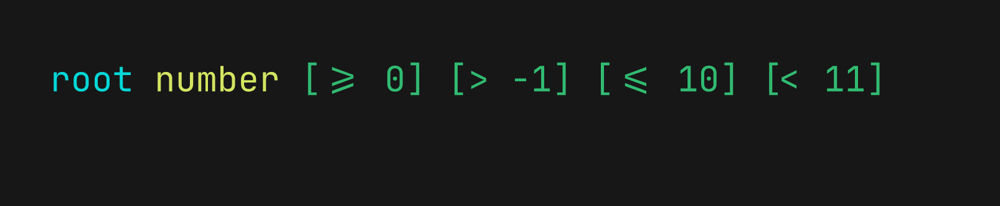

## precise-number

[Source](../tests/fixtures/render/precise-number.json)

### Input

```json
{
  "type": "number",
  "minimum": 0.12345678901234567890123456789,
  "multipleOf": 1e-400
}
```

### Output

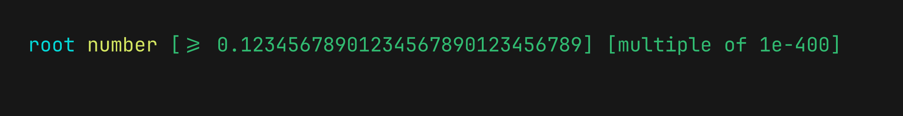

## property-order

[Source](../tests/fixtures/render/property-order.json)

### Input

```json
{
  "type": "object",
  "properties": {
    "z": {
      "type": "number"
    },
    "a": {
      "type": "string"
    }
  }
}
```

### Output

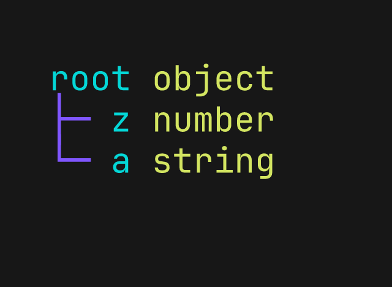

## reference-pointer

[Source](../tests/fixtures/render/reference-pointer.json)

### Input

```json
{
  "type": "object",
  "properties": {
    "first": { "$ref": "#/$defs/a~1b" },
    "alias": { "$ref": "#/properties/first" },
    "tilde": { "$ref": "#/$defs/tilde~0key" },
    "emptyName": { "$ref": "#/$defs/" },
    "encoded": { "$ref": "#/%24defs/a~1b" },
    "emptyRef": { "$ref": "" },
    "notSchema": { "$ref": "#/properties" },
    "anchor": { "$ref": "#Value" },
    "badEscape": { "$ref": "#/$defs/a~2b" }
  },
  "$defs": {
    "a/b": { "type": "string" },
    "tilde~key": { "type": "integer" },
    "": { "type": "boolean" }
  }
}
```

### Output

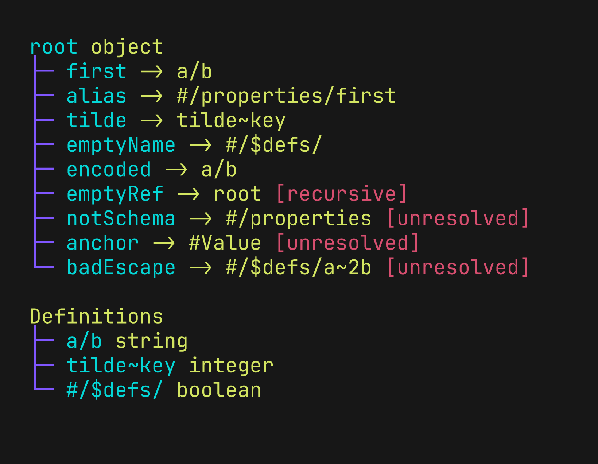

## reference-root

[Source](../tests/fixtures/render/reference-root.json)

### Input

```json
{
  "$ref": "#"
}
```

### Output

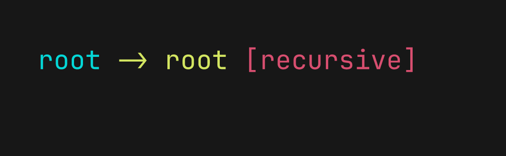

## reference-type-sibling

[Source](../tests/fixtures/render/reference-type-sibling.json)

### Input

```json
{
  "$ref": "#/$defs/Base",
  "type": "object",
  "maxProperties": 3,
  "$defs": {
    "Base": { "type": "object" }
  }
}
```

### Output

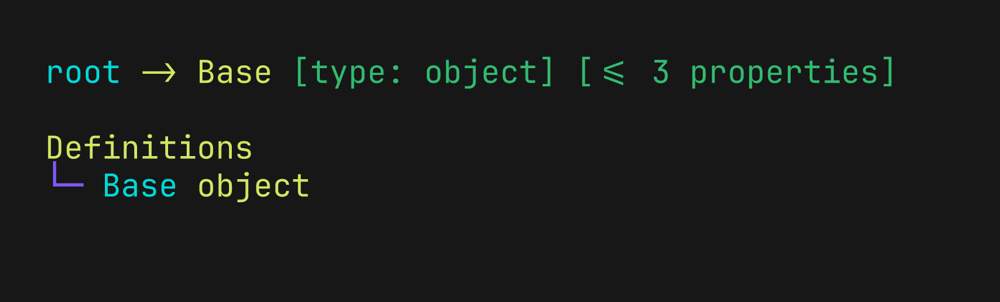

## references

[Source](../tests/fixtures/render/references.json)

### Input

```json
{
  "type": "object",
  "properties": {
    "home": { "$ref": "#/$defs/Address" },
    "office": { "$ref": "#/$defs/Address" },
    "manager": { "$ref": "#/$defs/Person" },
    "limitedAddress": {
      "$ref": "#/$defs/Address",
      "maxProperties": 2
    },
    "paidStatus": {
      "$ref": "#/$defs/Status",
      "const": "paid"
    },
    "missing": { "$ref": "#/$defs/Unknown" },
    "remote": {
      "$ref": "https://example.test/common.json#/$defs/Address"
    }
  },
  "required": ["home", "manager"],
  "$defs": {
    "Address": {
      "type": "object",
      "properties": {
        "city": { "type": "string" }
      },
      "required": ["city"],
      "additionalProperties": false
    },
    "Person": {
      "type": "object",
      "properties": {
        "name": { "type": "string" },
        "manager": { "$ref": "#/$defs/Person" }
      },
      "required": ["name"]
    },
    "Status": {
      "type": "string",
      "enum": ["pending", "paid"]
    }
  }
}
```

### Output

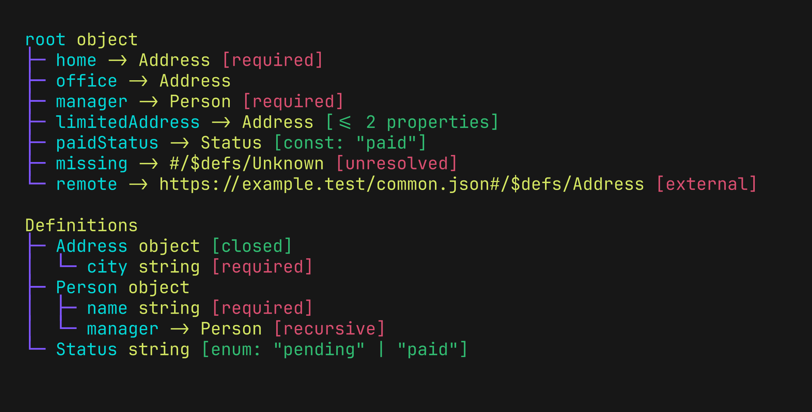

## resource-references

[Source](../tests/fixtures/render/resource-references.json)

### Input

```json
{
  "$schema": "https://json-schema.org/draft/2020-12/schema",
  "$id": "https://example.test/schemas/root.json",
  "type": "object",
  "properties": {
    "shared": {
      "$ref": "#/$defs/shared"
    },
    "child": {
      "$ref": "parts/child.json"
    },
    "childValue": {
      "$ref": "parts/child.json#/properties/value"
    }
  },
  "$defs": {
    "shared": {
      "type": "string"
    },
    "child": {
      "$id": "parts/child.json",
      "type": "object",
      "properties": {
        "value": {
          "type": "integer"
        },
        "self": {
          "$ref": "#"
        },
        "sharedFromParent": {
          "$ref": "../root.json#/$defs/shared"
        },
        "ownValue": {
          "$ref": "#/properties/value"
        }
      }
    }
  }
}
```

### Output

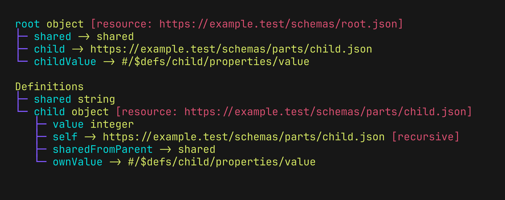

## scalar-string

[Source](../tests/fixtures/render/scalar-string.json)

### Input

```json
{
  "type": "string"
}
```

### Output

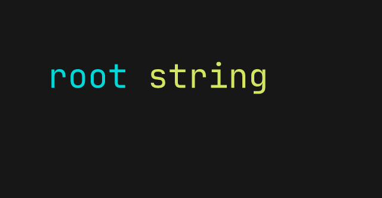

## string-constraints

[Source](../tests/fixtures/render/string-constraints.json)

### Input

```json
{
  "type": "object",
  "properties": {
    "slug": {
      "type": "string",
      "minLength": 1,
      "maxLength": 32,
      "pattern": "^[a-z0-9-]+$"
    },
    "code": {
      "type": "string",
      "maxLength": 8
    },
    "label": {
      "minLength": 2
    },
    "id": {
      "type": "string",
      "format": "uuid"
    }
  }
}
```

### Output

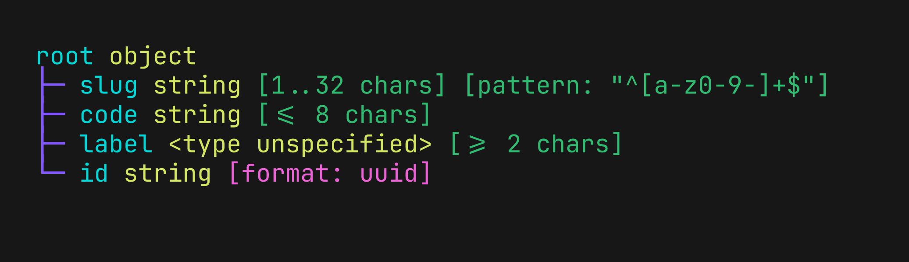

## tuple-boolean

[Source](../tests/fixtures/render/tuple-boolean.json)

### Input

```json
{
  "type": "array",
  "prefixItems": [
    true,
    false,
    {
      "type": "boolean"
    }
  ],
  "items": true
}
```

### Output

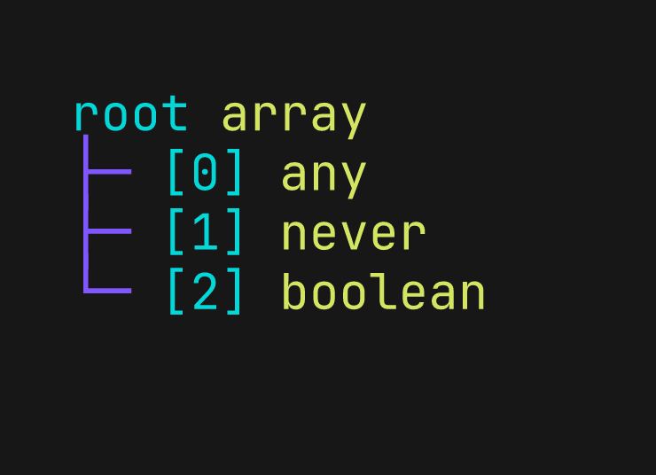

## tuple-object

[Source](../tests/fixtures/render/tuple-object.json)

### Input

```json
{
  "type": "array",
  "prefixItems": [
    {
      "type": "object",
      "properties": {
        "id": {
          "type": "string"
        }
      }
    }
  ]
}
```

### Output

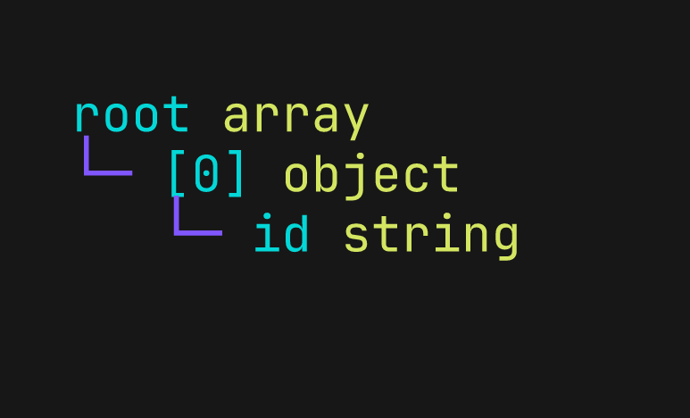

## tuple-tail

[Source](../tests/fixtures/render/tuple-tail.json)

### Input

```json
{
  "type": "array",
  "prefixItems": [
    {
      "type": "string"
    },
    {
      "type": "integer"
    }
  ],
  "items": {
    "type": "number",
    "minimum": 0
  }
}
```

### Output

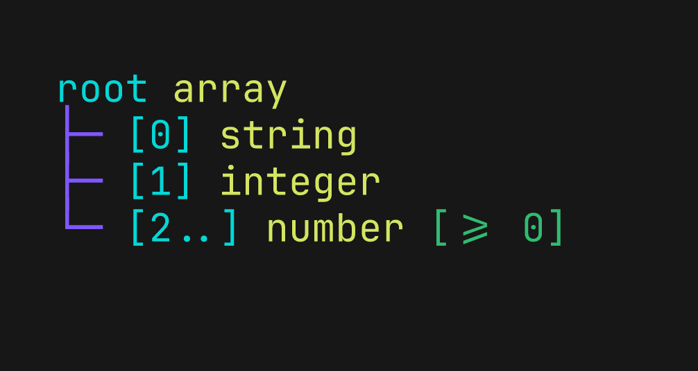

## tuple

[Source](../tests/fixtures/render/tuple.json)

### Input

```json
{
  "type": "array",
  "prefixItems": [
    {
      "type": "string"
    },
    {
      "type": "integer"
    }
  ],
  "items": false,
  "minItems": 2
}
```

### Output

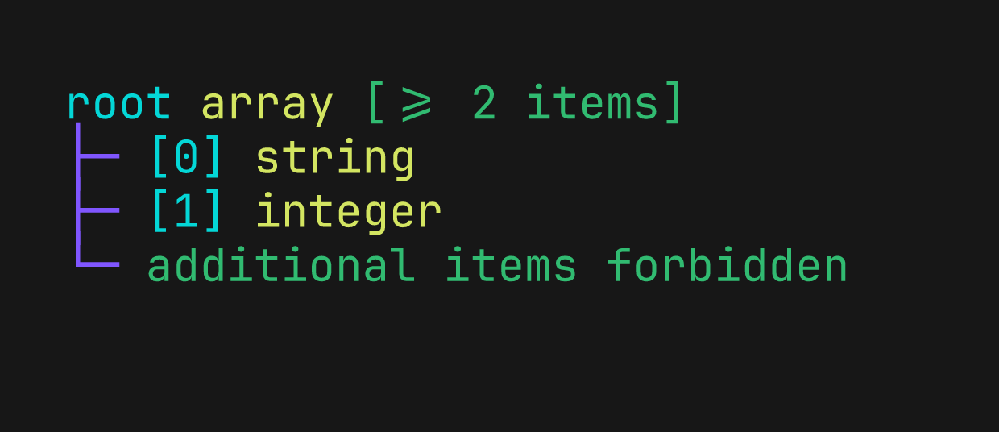

## type-unspecified

[Source](../tests/fixtures/render/type-unspecified.json)

### Input

```json
{
}
```

### Output

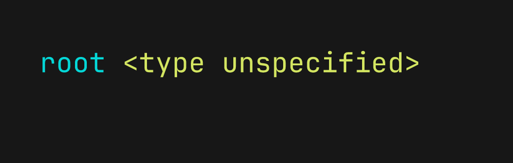

## unevaluated-items

[Source](../tests/fixtures/render/unevaluated-items.json)

### Input

```json
{
  "$schema": "https://json-schema.org/draft/2020-12/schema",
  "type": "array",
  "prefixItems": [
    {
      "type": "string"
    }
  ],
  "contains": {
    "type": "integer"
  },
  "unevaluatedItems": false
}
```

### Output

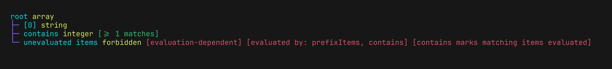

## unevaluated-object

[Source](../tests/fixtures/render/unevaluated-object.json)

### Input

```json
{
  "$schema": "https://json-schema.org/draft/2020-12/schema",
  "$defs": {
    "base": {
      "type": "object",
      "properties": {
        "tenantId": {
          "type": "string"
        }
      }
    }
  },
  "$ref": "#/$defs/base",
  "type": "object",
  "properties": {
    "id": {
      "type": "string"
    }
  },
  "allOf": [
    {
      "properties": {
        "status": {
          "enum": [
            "draft",
            "confirmed"
          ]
        }
      }
    }
  ],
  "unevaluatedProperties": false
}
```

### Output

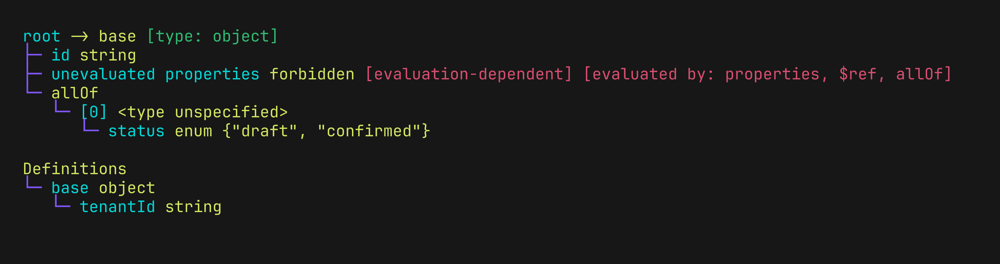

## uninterpreted-keyword

[Source](../tests/fixtures/render/uninterpreted-keyword.json)

### Input

```json
{
  "type": "string",
  "x-example": {
    "note": "demo"
  }
}
```

### Output

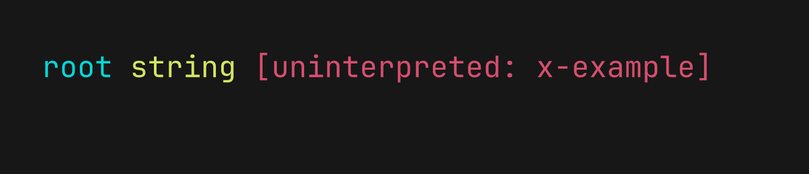

## unmatched-required

[Source](../tests/fixtures/render/unmatched-required.json)

### Input

```json
{
  "type": "object",
  "properties": {
    "known": {
      "type": "string"
    }
  },
  "required": [
    "known",
    "ghost"
  ]
}
```

### Output

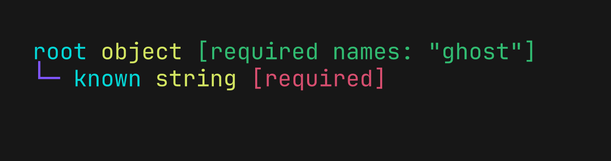

## untyped-additional-false

[Source](../tests/fixtures/render/untyped-additional-false.json)

### Input

```json
{
  "additionalProperties": false
}
```

### Output

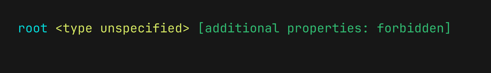

## untyped-properties

[Source](../tests/fixtures/render/untyped-properties.json)

### Input

```json
{
  "properties": {
    "flag": {
      "type": "boolean"
    }
  }
}
```

### Output

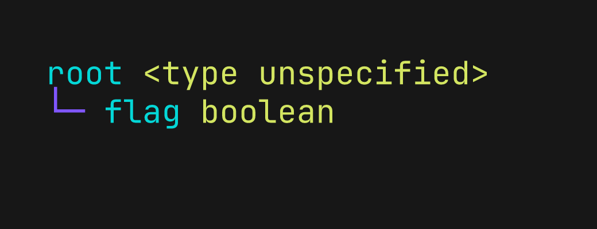

## untyped-tuple

[Source](../tests/fixtures/render/untyped-tuple.json)

### Input

```json
{
  "prefixItems": [
    {
      "type": "string"
    }
  ]
}
```

### Output

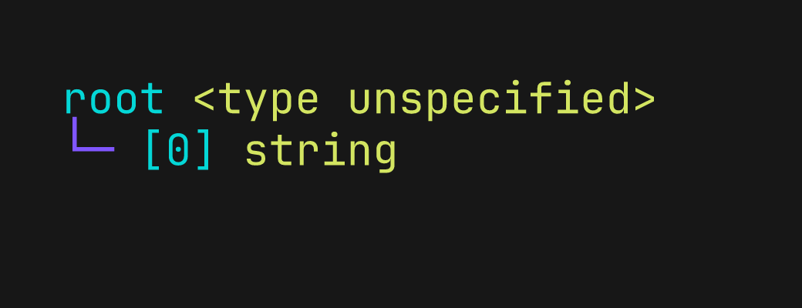
